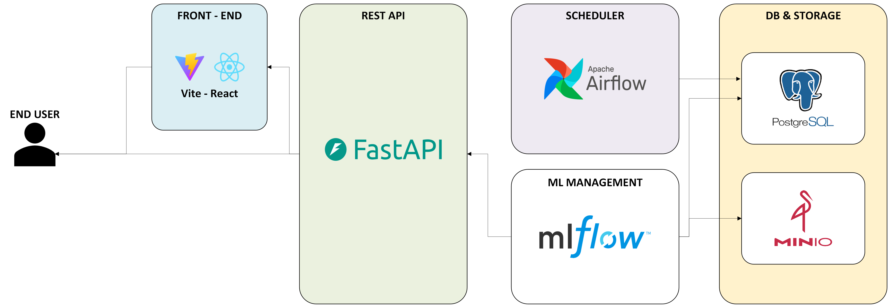

### MLOps1 - CEIA - FIUBA

## Trabajo práctico final

Este repositorio contiene una implementación completa de un pipeline
MLOps para entrenar, versionar, orquestar y desplegar un modelo que
predice la probabilidad de ocurrencia de delitos en la Ciudad de
Buenos Aires.

El proyecto incluye una arquitectura basada en Docker Compose que
integra:

- Airflow para orquestación de pipelines. 
- MLflow para tracking de experimentos y gestión de modelos. 
- FastAPI para servir el modelo entrenado. 
- MinIO como almacenamiento tipo S3 para artefactos. 
- PostgreSQL para Airflow y almacenamiento auxiliar.

Toda la infraestructura se levanta automáticamente mediante
`docker-compose` y se organiza alrededor de un flujo de entrenamiento e
inferencia del modelo.

------------------------------------------------------------------------

## Estructura del Repositorio

```
CEIA_MLOPS_1_TP
├── airflow/                     
│   ├── config/
│   ├── dags/                    
│   |   ├── data/
│   |   ├── models/
│   |   ├── scripts/   
│   |   ├── model_train_dag.py  
│   |   ├── preprocess_dag.py                    
│   |   ├── generate_baseline_dag.py
│   ├── dataset/                 
│   ├── logs/
│   ├── plugins/    
│   └── secrets/
├── frontend/
│   ├── public/
│   ├── node_modules/
│   ├── src/ 
│   ├── vite.config.js
│   ├── package.json
│   ├── index.html
├── dockerfiles/
│   ├── airflow/
│   │   ├── Dockerfile
│   │   └── requirements.txt
│   ├── fastapi/
│   │   ├── app.py
│   │   ├── Dockerfile
│   │   └── requirements.txt
│   ├── mlflow/
│   └── postgres/
|   └── frontend/
|        └── Dockerfile
```

------------------------------------------------------------------------

## Arquitectura Técnica

### **Airflow**

-   Contiene principalmente 3 DAGs. Estos realizan las siguientes tareas:
    -   Ingesta y preparación de datos. 
    -   Entrenamiento del modelo (`model_train.py`).
    -   Registro automático en MLflow.
    -   Publicación del modelo para inferencia.
    -   Generación de baseline utilizado para cálculos.

    Los tres dags son:
    - **preprocess_dag.py**: Encargado de importar el dataset desde los .csv. Realiza el preprocesamiento de los datos y los deja disponibles en el repositorio para que los pueda tomar model_train_dag.py. Ejecuta diariamente. 
    - **model_train_dag.py**: Realiza el entrenamiento del modelo XGBoost. Registra el entrenamiento, modelo y resultados de hiperparámetros en MLFlow. Ejecuta diariamente.
    - **generate_baseline.py**: Realiza preprocessing y genera .parquet de baseline que utiliza la API para cálculos de riesgos relativos. Ejecuta mensualmente.

    Si bien tanto preprocess_dag como generate_baseline realizan el procesamiento, se consideran dos DAGs distintos porque no se necesita generar el baseline con la misma periodicidad que el preprocesamiento, eficientizando el uso de recursos.

### **MLflow**

-   Se utiliza para:
    -   Registrar parámetros y métricas.
    -   Almacenar el modelo como artefacto.
    -   Versionar experimentos.
    -   Integrarse con MinIO para artefactos grandes.

### **FastAPI**

-   Expone endpoints como:
    -   `/predict`: retorna la probabilidad estimada de delito según
        entrada.

### **MinIO**

-   Almacena:
    -   Dataset en .parquet.
    -   Modelos MLflow.
    -   Artefactos del pipeline.

### **PostgreSQL**

-   Base persistente para Airflow y MLflow.

### **Frontend**

-   Aplicación web para disponibilizar el uso de la API a traves de una interfaz. Basado en Vite React.


### **Diagrama de arquitectura de alto nivel**



------------------------------------------------------------------------

## Puesta en Marcha

### **1. Clonar el repositorio**

``` bash
git clone <repo-url>
cd ceia_mlops_1_tp
```

### **2. Levantar la infraestructura**

``` bash
docker-compose --profile all up
```

Esto inicia: 
- Airflow en http://localhost:8080 
- MLflow en http://localhost:5000
- API en http://localhost:8000 
- MinIO en http://localhost:9000
- App Web en http://localhost:5173

### **3. Ejecutar el pipeline**

- Ingresar a Airflow y activar el DAG `baseline_pipeline`, seguido de `training_pipeline`. 
- Esto registra el modelo en MLFlow, donde se pueden ver las métricas e hiperparámetros del modelo entrenado. 
- Además, se puede utilizar el modelo vía API (FastAPI) en el endpoint `predict`.
- Para usuarios menos técnicos, se puede utilizar la interfáz gráfica http://localhost:5173/ donde se selecciona el barrio, día y franja horaria para obtener el nivel de riesgo estimado para los parámetros. 

------------------------------------------------------------------------

## Datos y Modelo

El proyecto utiliza datos públicos de [criminalidad histórica de Buenos
Aires](https://data.buenosaires.gob.ar/dataset/delitos).\

El pipeline incluye: 

- Transformaciones básicas y agregaciones temporales. 
- Entrenamiento de un modelo predictivo (normalmente un algoritmo de clasificación probabilística). 
- Generación del score de riesgo por zona y franja horaria.

El modelo final se publica automáticamente para que FastAPI lo consuma.

------------------------------------------------------------------------

## Integrantes 
 	Josmar Brazón
 	Gaspar Rivollier
 	Martín Andrés
 	Martín Gonzalez
 	Juan Cruz
 	Agustín Maglione


